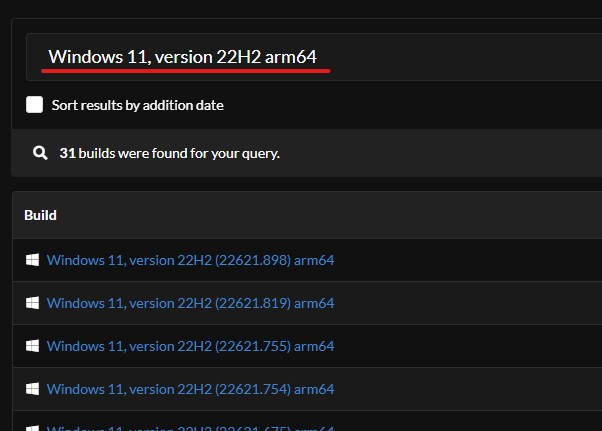
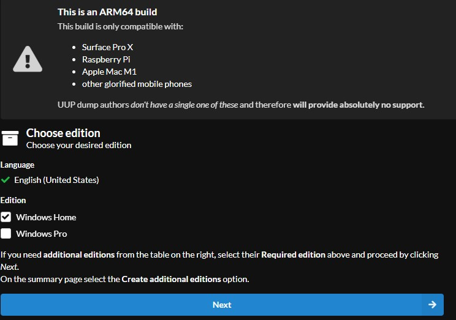
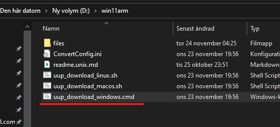
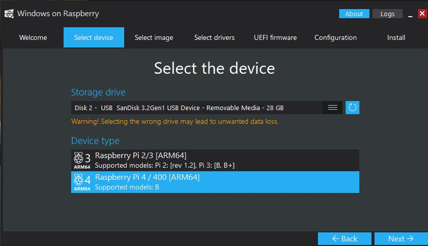
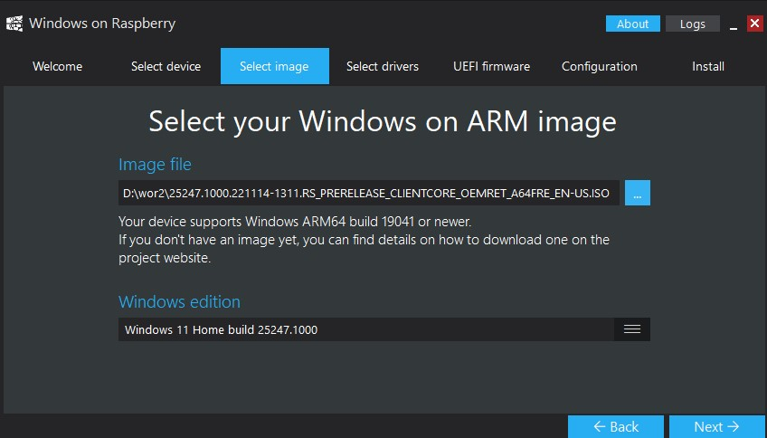
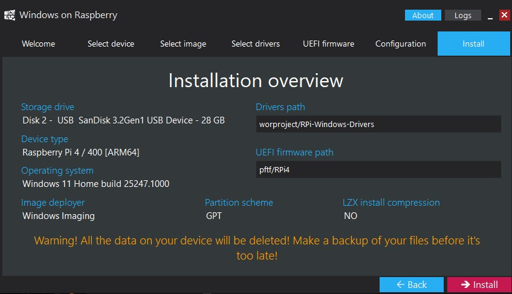

$\textcolor{red}{\text{Install Windows 11 on a Raspberry Pi 4}}$
========================================
$\textcolor{#c5f015}{\text{Windows}}$
-----
### Go to https://uupdump.net and search for Windows 11, version 22H2 arm64

### Download the image

### Run the script. It takes around an hour.

### Download WOR https://www.worproject.com/downloads and prepare USB

### Install. It takes around an hour.

